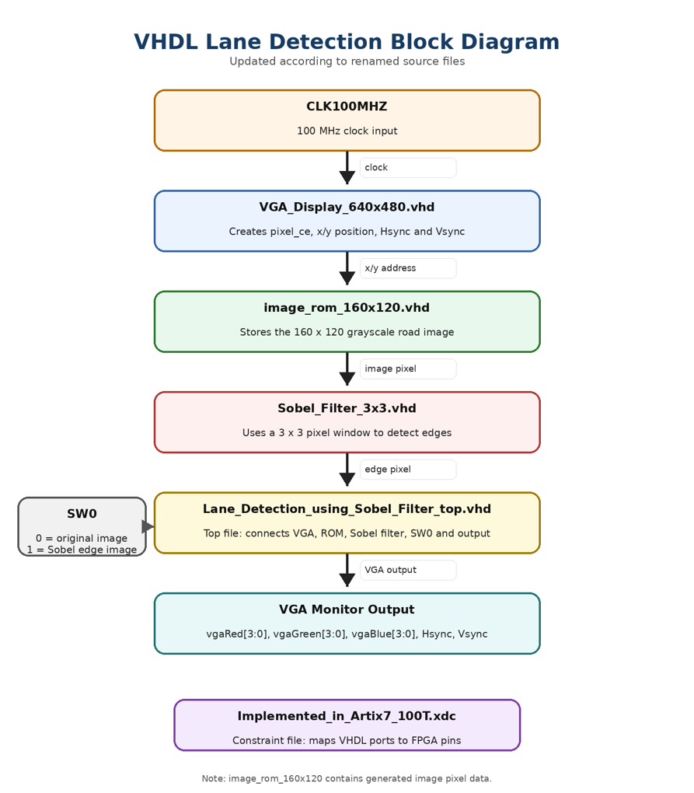
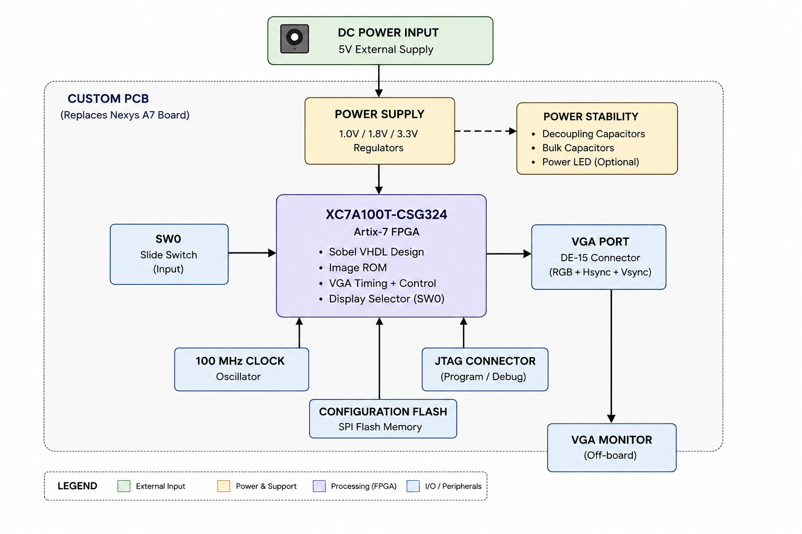

# Lane Detection using Sobel Filter

This project implements a simple ROM-based Sobel lane-edge detection system on an FPGA. The design reads a stored road image from ROM, processes it with a 3x3 Sobel filter, and displays either the original image or the Sobel edge output on a VGA monitor.

The project was first implemented and tested on the Nexys A7 FPGA board. The PCB part represents a simplified custom FPGA board concept that could replace the Nexys A7 board hardware. The Sobel logic still runs inside the FPGA.

---

## Project Goal

The goal of this project is to demonstrate lane-edge detection using VHDL on an FPGA and then prepare a simplified FPGA-to-PCB concept for the same system.

The system uses:

- A stored grayscale road image
- A Sobel 3x3 edge detection filter
- VGA output for displaying the result
- SW0 switch to select between original image and Sobel edge image
- A custom PCB concept with FPGA, clock, power, VGA, JTAG, configuration flash, and decoupling capacitors

---

## Project Workflow

The project follows these main steps:

1. Concept description and block diagram
2. VHDL implementation
3. Verification and testbench
4. FPGA implementation on Nexys A7
5. Hardware realization and FPGA configuration
6. PCB design, netlisting, and PCB layout

---

## Team Contribution

| Task / Area | Responsible person |
|---|---|
| Concept and Implementation in VHDL and FPGA, Hardware realization and setup, Design Schematic, Netlisting and PCB Layout,Routing Documentation | Md Mostafizur Rahman |
| Testbench | Deepak Kapil |
| Documentation, Netlisting Schematic, PCB layout, Gerber, BOM  | Turja Barua |

---

## Files to Add in Vivado

Add these VHDL files:

- `src/Lane_Detection_using_Sobel_Filter_top.vhd`
- `src/VGA_Display_640x480.vhd`
- `src/image_rom_160x120.vhd`
- `src/Sobel_Filter_3x3.vhd`

Add this constraint file:

- `constraints/Implemented_in_Artix7_100T.xdc`

---

## Top Entity

Use this top entity in Vivado:

```text
Lane_Detection_using_Sobel_Filter_top
```

---
# FPGA Hardware

- Digilent Nexys A7 (XC7A100T-CSG324)
- 100 MHz System Clock
- VGA Monitor
- SW0 Slide Switch

---

## Board Control

Only one switch is used:

| Switch | Function |
|---|---|
| `SW0 = 0` | Show original road image |
| `SW0 = 1` | Show Sobel edge image |

---
## Block Diagram



---
## System Explanation

The VGA display module creates the current screen positions `x` and `y`. The image ROM gives one road-image pixel for that position. The Sobel filter module detects edges from the pixel stream. The `SW0` switch selects whether the VGA monitor shows the original road image or the Sobel edge-detection result.

---

## VHDL Design Modules

| File | Function |
|---|---|
| `Lane_Detection_using_Sobel_Filter_top.vhd` | Top-level design that connects all modules together |
| `VGA_Display_640x480.vhd` | Generates VGA timing, screen coordinates, Hsync, and Vsync |
| `image_rom_160x120.vhd` | Stores the grayscale road image inside FPGA ROM |
| `Sobel_Filter_3x3.vhd` | Performs Sobel edge detection using a 3x3 pixel window |
| `Implemented_in_Artix7_100T.xdc` | Maps the VHDL ports to Nexys A7 / Artix-7 FPGA pins |

---

# Image Resolution Comparison

Two FPGA implementations were developed.

| Version | ROM Resolution | VGA Output |
|----------|---------------|------------|
| Version 1 | 160 × 120 | 640 × 480 |
| Version 2 | 320 × 240 | 640 × 480 |

The upgraded implementation stores four times more pixels while maintaining the same VGA output resolution. This significantly improves edge quality and lane visibility.

---

## FPGA-to-PCB Concept

The PCB design is a simplified custom FPGA board concept. It includes only the hardware needed for this project.

Main PCB blocks:

- Artix-7 XC7A100T-CSG324 FPGA
- 100 MHz oscillator
- SW0 slide switch
- VGA connector / DE-15 connector
- 1.0V, 1.8V, and 3.3V power supplies
- JTAG/programming connector
- Configuration flash memory
- Decoupling capacitors for power stability
- Optional power LED for debugging

Important explanation:

The custom PCB does not replace the FPGA logic. It replaces the Nexys A7 board hardware. The Sobel VHDL design still runs inside the Artix-7 FPGA.

---

## Block Diagram



---

## Limitation

This project does not use a live camera. The road image is stored in FPGA ROM. The purpose is to demonstrate the FPGA-based Sobel image-processing flow and the transition from an FPGA prototype to a simplified custom PCB concept.
